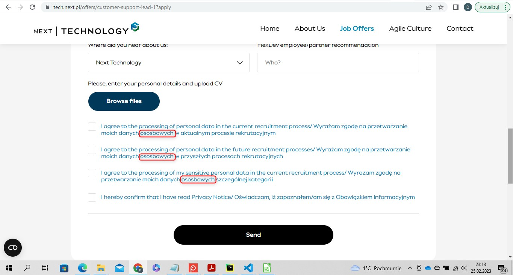
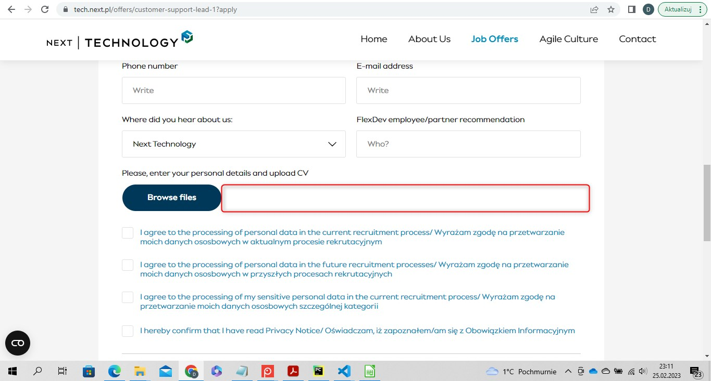

## IT NEXT - 1st Bug Report

 

| Elements of the issue | Description |
| -------------------------------- |  -------------------------------- |
| Title | A typo in the 'Job Offers' section |
| Environment | A computer with Windows 10 Home system, Version: 10.0.19044 Compilation 19044   Chrome browser, version: 110.0.5481.104 |
| Priority	| Low |
| Steps to reproduce | 1. Open the browser   2. Go to https://it.next.pl   3. Click on 'Job Offers' that is placed on the navigation bar   4. Scroll down and choose one of the job advertisements, click on it   5. Click on the button 'Apply' which is placed on the right side   6. Scroll down until the section with check boxes |
| Actual result | By the 1st, 2nd and 3rd checkboxes the text in polish contains a typo, the 7th word is written incorrectly (ososbowych) |
| Expected result |	The text in polish is written correctly by all of the checkboxes. The 7th word is written 'osobowych' |
| Additional information | The bug concerns to all of the job offers |
 

   

## IT NEXT - 2nd Bug Report

| Elements of the issue | Description |
| -------------------------------- |  -------------------------------- |
| Title | White empty space acts as a button 'Browse files' |
| Environment | A computer with Windows 10 Home system, Version: 10.0.19044 Compilation 19044   Chrome browser, version: 110.0.5481.104 |
| Priority	| Low |
| Steps to reproduce | 1. Open the browser   2. Go to https://it.next.pl   3. Click on 'Job Offers' that is placed on the navigation bar   4. Scroll down and choose one of the job advertisements, click on it   5. Click on the button 'Apply' which is placed on the right side   6. Scroll down until the button 'Browse files'   7. Click on the blank space on the right side of the button |
| Actual result | The button 'Browse files' and the white empty space located on the right side of the button gives a possibility to upload files from user's device |
| Expected result |	Only the button 'Browse files' gives a possibility to upload any files from the user's device |
| Additional information | The bug concerns to all of the job offers |
 

