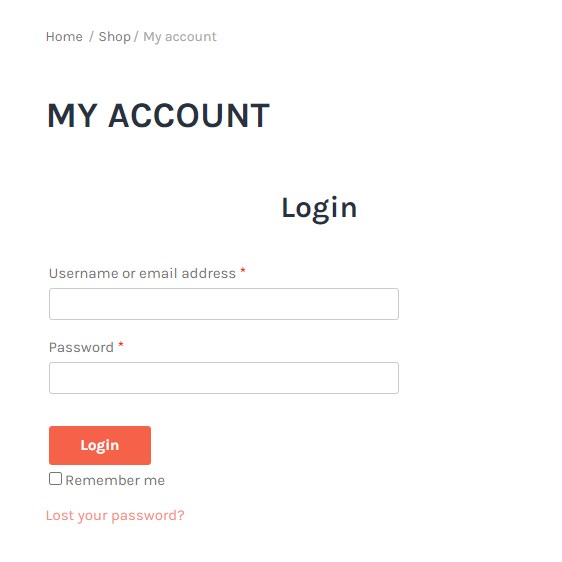

# Test plan for Login page testing - fake online store: [http://skleptest.pl/](http://skleptest.pl/) 
It contains test cases: happy path and also negative.

## Test Environment:
### Computer with OS: Windows 10 Home  
### Browsers:
- Google Chrome - the latest version, at least version 110.0.5481.104  
- Firefox - the latest version, at least version 110.0.1
- Microsoft Edge - the latest version, at least version 110.0.1587.57
 
 

 

## Test case 01: Login page - Signing in with correct data (username & password)

### TC Description:
The goal of the test is to check if it is possible to sign in when the user gives the existing username and correct password.

Preconditions:
- The user must be registered and use an existing email address and password.

- The browser is open.

- The user has an open and accessible website: http://skleptest.pl

- The user needs to click on the button 'My account' which is placed in the upper right corner, the page will be reloaded and will take the user to the login page (https://skleptest.pl/my-account/)

| # | Description | Expected result |
| -------------------------------- |-------------------------------- |  -------------------------------- | 
| 1 | In the field 'email address' type the existing username that is registered | The user sees the username in the field |
| 2 | In the field 'password' type the correct password | The password is hidden but the user sees the security dots (their number is the number of the typed password's signs) |
| 3 | Click on the button 'Login' | The system signs the user in. The user is in the user panel |

 
 

## Test case 02: Login page - incorrect data (email & password)

### TC Description:
The goal of the test is to check if it is possible to sign in when the user enters incorrect email and password.

Preconditions:
- The browser is open.

- The user has an open and accessible website: http://skleptest.pl

- The user needs to click on the button 'My account' which is placed in the upper right corner, the page will be reloaded and will take the user to the login page (https://skleptest.pl/my-account/)

| # | Description | Expected result |
| -------------------------------- |-------------------------------- |  -------------------------------- | 
| 1 | In the field 'email address' type the an email address that is not registered | The user sees the email address in the field |
| 2 | In the field 'password' type the incorrect password  | The password is hidden but the user sees the security dots (their number is the number of the typed password's signs) |
| 3 | Click on the button 'Login' | The system does not let the user to log in. The system gives the information about incorrect email and password that has been entered |

 
 

## Test case 03: Login page - Incorrect email address

### TC Description:
The goal of the test is to check if it is possible to sign in when the user enters incorrect email address

Preconditions:
- The user must be registered and use the existing password.

- The browser is open.

- The user has an open and accessible website: http://skleptest.pl

- The user needs to click on the button 'My account' which is placed in the upper right corner, the page will be reloaded and will take the user to the login page (https://skleptest.pl/my-account/)

| # | Description | Expected result |
| -------------------------------- |-------------------------------- |  -------------------------------- | 
| 1 | In the field 'email address' type the incorrect email address that is not registered in the data base | The user sees the email address in the field |
| 2 | In the field 'password' type the correct password | The password is hidden but the user sees the security dots (their number is the number of the typed password's signs) |
| 3 | Click on the button 'Login' | The system does not let the user to log in. The system gives the information about incorrect email or password that has been entered |

 
 

## Test case 04: Login page - Incorrect password

### TC Description:
The goal of the test is to check if it is possible to sign in when the user enters incorrect password

Preconditions:
- The user must be registered and use an existing email address.

- The browser is open.

- The user has an open and accessible website: http://skleptest.pl

- The user needs to click on the button 'My account' which is placed in the upper right corner, the page will be reloaded and will take the user to the login page (https://skleptest.pl/my-account/)

| # | Description | Expected result |
| -------------------------------- |-------------------------------- |  -------------------------------- | 
| 1 | In the field 'email address' type the existing email address that is registered | The user sees the email address in the field |
| 2 | In the field 'password' type the incorrect password | The password is hidden but the user sees the security dots (their number is the number of the typed password's signs) |
| 3 | Click on the button 'Login' | The system does not let the user to log in. The system gives the information about incorrect email or password that has been entered |

 
 

## Test case 05: Login page - No password 

### TC Description:
The goal of the test is to check if the application will let the user to log in if the user uses only the email address and no password.

Preconditions:
- The user must be registered and use an existing email address.

- The browser is open.

- The user has an open and accessible website: http://skleptest.pl

- The user needs to click on the button 'My account' which is placed in the upper right corner, the page will be reloaded and will take the user to the login page (https://skleptest.pl/my-account/)

| # | Description | Expected result |
| -------------------------------- |-------------------------------- |  -------------------------------- | 
| 1 | In the field 'email address' type the correct email address that is  registered in the data base - type it by using the uppercase letters | The user sees the email address in the field |
| 2 | Click on the button 'Login' | The system does not let the user to log in. The system gives the information about inccorect email and/or password that has been entered |

 
 

## Test case 06: Login page - Login page - Signing in with no data

### TC Description:
The goal of the test is to check if it is possible to login without giving any data (email/username, password)

Preconditions:
- The browser is open.

- The user has an open and accessible website: http://skleptest.pl

- The user needs to click on the button 'My account' which is placed in the upper right corner, the page will be reloaded and will take the user to the login page (https://skleptest.pl/my-account/)

| # | Description | Expected result |
| -------------------------------- |-------------------------------- |  -------------------------------- | 
| 1 | Do not type any data, click on the button 'Login' | The website gives the user an information that fields 'Username/e-mail address' and 'password' are required, the system does not sign in |

 
 

## Test case 07: Login page - Email address - Uppercase letters 

### TC Description:
The goal of the test is to check if the application will let the user to log in, if the user uses uppercase letters in the email address.

Preconditions:
- The user must be registered and use an existing email address and password.

- The browser is open.

- The user has an open and accessible website: http://skleptest.pl

- The user needs to click on the button 'My account' which is placed in the upper right corner, the page will be reloaded and will take the user to the login page (https://skleptest.pl/my-account/)

| # | Description | Expected result |
| -------------------------------- |-------------------------------- |  -------------------------------- | 
| 1 | In the field 'email address' type the correct email address that is  registered in the data base - type it by using the uppercase letters | The user sees the email address in the field |
| 2 | In the field 'password' type the correct password | The password is hidden but the user sees the security dots (their number is the number of the typed password's signs) |
| 3 | Click on the button 'Login' | The system signs the user in. The user is in the user panel |

 
 

## Test case 08: Login page - Password - Uppercase letters 

### TC Description:
The goal of the test is to check if the application will let the user to log in, if the user uses uppercase letters in the email address.

Preconditions:
- The user must be registered and use an existing email address and password.

- The password that has been given needs to contain minimum 1 lowercase letter

- The browser is open.

- The user has an open and accessible website: http://skleptest.pl

- The user needs to click on the button 'My account' which is placed in the upper right corner, the page will be reloaded and will take the user to the login page (https://skleptest.pl/my-account/)

| # | Description | Expected result |
| -------------------------------- |-------------------------------- |  -------------------------------- | 
| 1 | In the field 'email address' type the correct email address that is  registered in the data base | The user sees the email address in the field |
| 2 | In the field 'password' type the correct password using only uppercase letters | The password is hidden but the user sees the security dots (their number is the number of the typed password's signs) |
| 3 | Click on the button 'Login' | The system informs the user that the email address and/or password is incorrect |

 
 

## Test case 09: Login page - Entering incorrect data 3 times

### TC Description:
The goal of the test is to check if after entering incorrect password 3 times the account will be blocked.

Preconditions:
- The user must be registered and use an existing email address.

- The browser is open.

- The user has an open and accessible website: http://skleptest.pl

- The user needs to click on the button 'My account' which is placed in the upper right corner, the page will be reloaded and will take the user to the login page (https://skleptest.pl/my-account/)

| # | Description | Expected result |
| -------------------------------- |-------------------------------- |  -------------------------------- | 
| 1 | In the field 'email address' type the existing email address that is registered | The user sees the email address in the field |
| 2 | In the field 'password' type the incorrect password | The password is hidden but the user sees the security dots (their number is the number of the typed password's signs) |
| 3 | Click on the button 'Login' | The system does not let the user to log in. The system gives the information about incorrect email or password that has been entered |
| 4 | Repeat steps: 1, 2, 3 - another 2 times | After the 3rd time of entering incorrect password the system informs the user that the account has been blocked and it is needed to reset it|
| 5 | Enter the correct email address | The user sees the email address in the field |
| 6 | Enter the correct password  | The user sees the security dots in the field of password |
| 7 | Click on the button 'Login' | The system informs the user that the account had been blocked and it is needed to reset the password |

 
 

## Test case 10: Login page - Remember me checkbox

### TC Description:
The goal of the test is to check if marked checkbox 'Remember me' by signing in will keep the user to be logged in, in the future sessions.

Preconditions:
- The user must be registered and use an existing email address and password.

- The browser is open.

- The user has an open and accessible website: http://skleptest.pl

- The user needs to click on the button 'My account' which is placed in the upper right corner, the page will be reloaded and will take the user to the login page (https://skleptest.pl/my-account/)

| # | Description | Expected result |
| -------------------------------- |-------------------------------- |  -------------------------------- | 
| 1 | In the field 'email address' type the existing email address that is registered | The user sees the email address in the field |
| 2 | In the field 'password' type the correct password | The password is hidden but the user sees the security dots (their number is the number of the typed password's signs) |
| 3 | Mark the checkbox 'Remember me' | There is a visible tick in the checkbox |
| 4 | Click on the button 'Login' | The system signs the user in. The user is in the user panel. |

 
 

## Test case 11: Remember me checkbox - incorrect data 

### TC Description:
The goal of the test is to check if the application will remember incorrect user data by marking the checkbox 'Remember me' and trying to log in.

Preconditions:
- The browser is open.

- The user has an open and accessible website: http://skleptest.pl

- The user needs to click on the button 'My account' which is placed in the upper right corner, the page will be reloaded and will take the user to the login page (https://skleptest.pl/my-account/)

| # | Description | Expected result |
| -------------------------------- |-------------------------------- |  -------------------------------- | 
| 1 | In the field 'email address' type the incorrect email address that is not registered in the data base | The user sees the email address in the field |
| 2 | In the field 'password' type the incorrect password | The password is hidden but the user sees the security dots (their number is the number of the typed password's signs) |
| 3 | Mark the checkbox 'Remember me' | There is a visible tick inside of the checkbox |
| 4 | Click on the button 'Login' | The system does not let the user to log in. The systen gives the information about incorrect email or password that has been entered. Incorrect data has not been remembered on the login page |

 
 

## Test case 12: Login page - Login page - Resetting the password

### TC Description:
The goal of the test is to check if it is possible to reset the password.

Preconditions:
- The user must be registered and use an existing email address and password.

- It is needed to have a mailbox on registered email.

- The browser is open.

- The another card in the browser must be open.

- The user must sign in the mailbox.

- The user has an open and accessible website: http://skleptest.pl

- The user needs to click on the button 'My account' which is placed in the upper right corner, the page will be reloaded and will take the user to the login page (https://skleptest.pl/my-account/)

| # | Description | Expected result |
| -------------------------------- |-------------------------------- |  -------------------------------- | 
| 1 | Click on the link 'Lost your password?' which is placed under the 'Login' button | The application takes the user to the website with the field to enter the email address or username |
| 2 | Enter the correct email address | The user sees the email address in the field |
| 3 | Click on the button 'Reset password' | The application informs the user that the email with a link has been sent. The user receives the email to the mailbox |
| 4 | In the mailbox open the email from the application | The user sees the message with the link in order to reset the password |
| 5 | Click on the link | The user is taken to the website where a new password can be assigned |
| 6 | Give a new password in the field and click 'Reset the password' | The system informs the user that the password has been reset |

 
 

## Test case 13: Login page - Using reset password

### TC Description:
The goal of the test is to check if it is possible to log in using the reset password.

Preconditions:
- The user must be registered and use an existing email address and password.

- It is needed to have a mailbox on registered email.

- The browser is open.

- The another card in the browser must be open.

- The user must sign in the mailbox.

- The user has an open and accessible website: http://skleptest.pl

- The user needs to click on the button 'My account' which is placed in the upper right corner, the page will be reloaded and will take the user to the login page (https://skleptest.pl/my-account/)

| # | Description | Expected result |
| -------------------------------- |-------------------------------- |  -------------------------------- | 
| 1 | Click on the link 'Lost your password?' which is placed under the 'Login' button | The application takes the user to the website with the field to enter the email address or username |
| 2 | Enter the correct email address | The user sees the email address in the field |
| 3 | Click on the button 'Reset password' | The application informs the user that the email with a link has been sent. The user receives the email to the mailbox |
| 4 | In the mailbox open the email from the application | The user sees the message with the link in order to reset the password |
| 5 | Click on the link | The user is taken to the website where a new password can be assigned |
| 6 | Give a new password in the field, repeat it in the proper field and click 'Reset the password' | The system informs the user that the password has been reset |
| 7 | Go to the login page http://skleptest.pl/my-account/ | The user sees the login page |
| 8 | Enter the correct email address and new password | The user sees the email address and the security dots in the password field |
| 9 | Click on the button 'Login' | The system takes the user to the user panel |

 
 